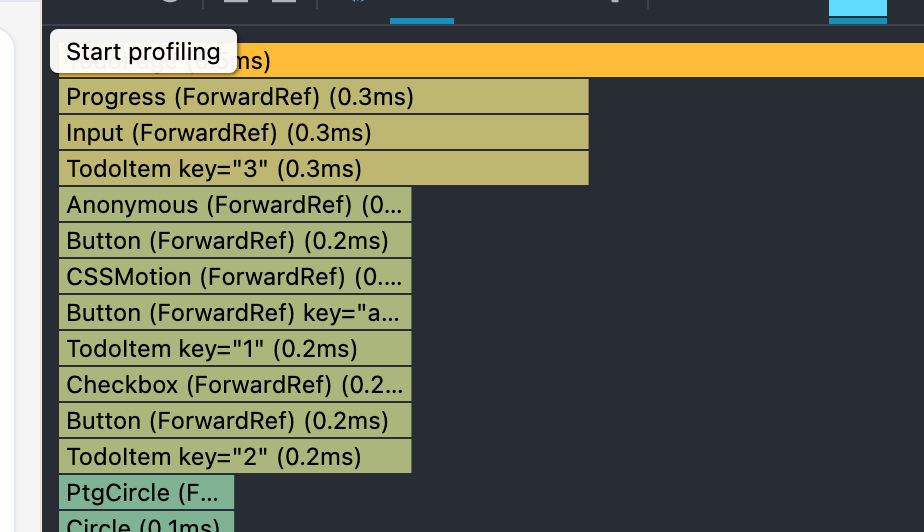
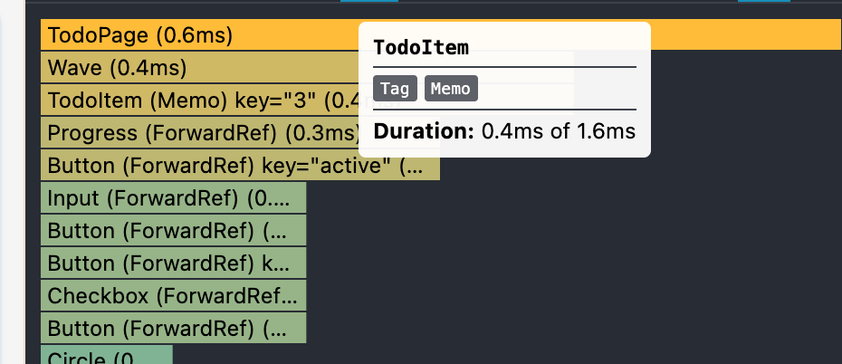

# 第六天学习笔记：React DevTools Profiler 实战
核心目标：用 React DevTools 的 Profiler 面板系统性地分析你的 Todo 项目，找出不必要的重复渲染，并综合运用前五天学到的 React.memo、useCallback、useMemo 进行优化，用数据验证效果。

一、Profiler 录制与分析
操作步骤：
1. 打开 Chrome DevTools → ⚛️ Profiler 标签。
2. 点击录制按钮，在应用中执行一组典型操作（添加 Todo、标记完成、删除、输入搜索）。
3. 停止录制，获取火焰图。
关键图表解读：
● 火焰图中每一栏代表一次提交（commit），右侧显示该次提交的渲染耗时。
● 选中一次提交，可看到该次渲染的组件树。
● 灰色区块：本次没有重新渲染的组件（理想状态）。
● 黄色/绿色区块：重新渲染了的组件（需要优化）。

二、定位到的性能问题
问题组件列表：
组件	问题描述	原因分析
TodoItem	每次父组件更新时全部重新渲染，即使自身数据未变	父组件传递的函数回调每次都是新引用，且子组件未用 React.memo
TodoList	添加或编辑单条 Todo 时整个列表重渲染	父组件状态变化导致子树全部重渲染
AddTodo	输入框每次键入都会引起列表区重渲染（或反之）	输入框与列表共享同一个父组件，状态提升导致相互影响
判断标准：如果一个组件的 props 和 state 与上次完全相同，但仍被重新执行，即为不必要的渲染。

三、针对性优化措施
优化一：用 React.memo 包裹 TodoItem
const TodoItem = React.memo(function TodoItem({ todo, onToggle, onDelete }) {
  // ...
});
效果：当 todo 对象和回调函数引用未变时，跳过该 TodoItem 的渲染。
优化二：用 useCallback 稳定回调函数引用
const handleToggle = useCallback((id) => {
  setTodos(prev => prev.map(todo => 
    todo.id === id ? { ...todo, done: !todo.done } : todo
  ));
}, []); // 空依赖，使用函数式更新

const handleDelete = useCallback((id) => {
  setTodos(prev => prev.filter(todo => todo.id !== id));
}, []);
效果：onToggle 和 onDelete 在重渲染时保持同一引用，配合 React.memo 使未修改的 TodoItem 跳过重渲染。
优化三：用 useMemo 缓存派生数据
const completedCount = useMemo(() => {
  return todos.filter(todo => todo.done).length;
}, [todos]);
效果：避免每次渲染都重新计算已完成数量。
优化四：拆分输入框为独立组件
● 将 <input> 和其状态抽离为 AddTodo 组件，并用 React.memo 包裹。
● 父组件不再因输入变化而重渲染整个列表。

四、优化效果对比
优化前

优化后

指标	优化前	优化后
添加一条 Todo 导致的 TodoItem 渲染数	所有 TodoItem 重渲染	仅新增的 TodoItem 渲染
单次提交平均耗时	较长（含不必要的 Diff）	明显缩短
标记完成时重渲染的组件数量	整个列表	仅被修改的那一个 TodoItem
结论：通过组合 React.memo、useCallback、useMemo 和组件拆分，不必要渲染大幅减少，交互更流畅。

五、性能优化方法论
1. 先测量，再优化 —— 用 Profiler 定位真正的瓶颈，不要凭感觉。
2. 稳定引用是前提 —— 对于传递给 React.memo 子组件的对象/函数 props，使用 useCallback / useMemo 保持引用稳定。
3. 组件拆分 —— 将频繁变化的部分隔离到独立组件，避免拖累全局。
4. 优化后必须验证 —— 再次录制 Profiler，对比前后数据，确保优化有效。

六、个人总结
今天我用 React DevTools Profiler 对自己的 Todo 项目做了一次完整的性能审计，亲手找出了哪些组件在白白重渲染，并通过 React.memo + useCallback + 组件拆分成功优化了它们。我体会最深的是：性能优化不是对着代码瞎猜，而是先测量、再分析、最后对引用类型做记忆化，并让 React.memo 真正发挥作用。这次实战让我从“知道 API”进化到了“能用工具系统化优化应用”，也为面试中展示工程能力积累了真实案例。